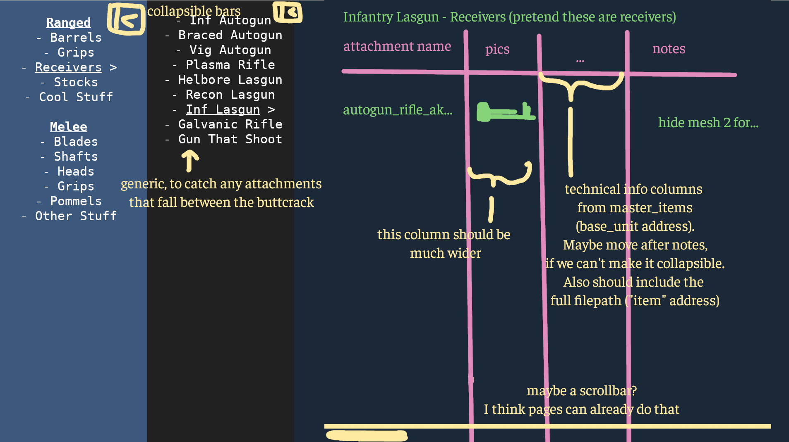

The Google Sheets plan was more trouble than it was worth. Let's create a new plan.

# Hosting the Attachments Library on GitHub Pages
1. Extract the game files
2. Read the attachment > weapon folder (?) relationships
3. Generate a manifest or some other guide file listing these out
    1. Create the base entry for the type of attachment you want to find (e.g "Stocks")
    2. Have something to look through each weapon folder in content/weapons/player/ranged/ and see if it finds any attachment folders named "stock_*". Or something involving the folder paths
    3. if it finds any attachment folders with that name, create the weapon entry in the table based off of the weapon folder it's currently in (e.g if it's currently looking through the "autogun_rifle" folder, it'll create an entry with that name\*) 
    4. then if it makes that weapon entry, go through and add each attachment named "stock_*" as a sub-entry
    5. repeat until it's gone through each weapon folder to find stocks, then go through the next attachment category
    6. if you wanted to overcomplicate it, you could potentially even create a localisation table, so if it finds "autogun_rifle_ak" for example, it converts to "Braced Autogun"
4. Upload the manifest into the repo
5. Have the GitHub Page with the code to dynamically fill out the attachment names using that manifest
6. Read the master_items dump for supplementary information on each attachment
    - Just need the base_unit, since the item address is the file address
    - The item address is how we'll find which row to edit
7. Dynamically add that info to each row on the GitHub Page
8. Have our separate images/notes created, with some mapping to each attachment
    - I imagine it'll be a json, mapped by the item address
    - `{ "content/items/weapons/player/ranged/stocks/plasma_rifle_stock_04" = "Notes as one big string. Could there be markdown with this? A question for later "}`
    - I'm not sure how images would go. Maybe instead of `"item address" = "notes in a string"`, it's `"item address" = {"notes" = "note", "image_urls" = ["url1"] }`
9. Also dynamically add that to each row on the page

The end result is probably something like this:

>[!WARNING]
> 
> Getting the images will be very tedious
> 
> There should be a way to automate this, but still allow the flexibility of manually added images
> 
> The "working" plan is to somehow create a Blender script which renders all attachments --> displays them one frame at a time --> screenshots each frame and names the file after the file address --> dump that in the repo --> dynamically fill rows based on that
> 
> In theory, could this be made to have an exploded view of each part, with the nodes/sub-meshes clearly labelled?