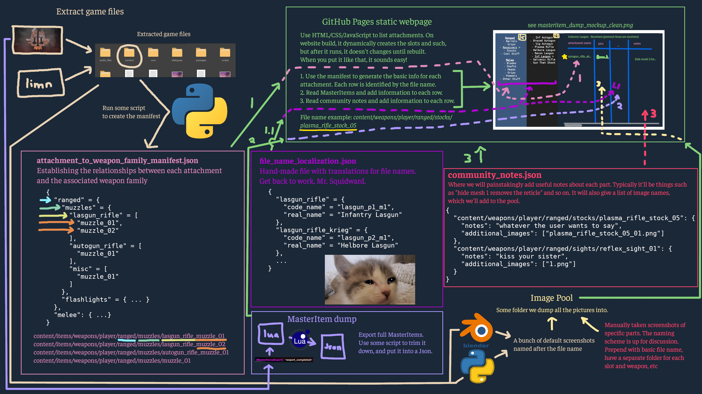
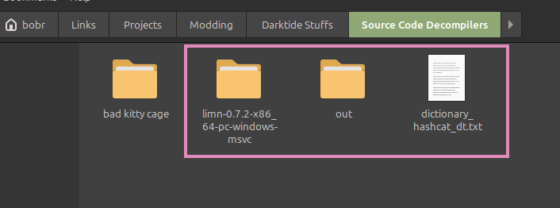

The Google Sheets plan was more trouble than it was worth. Let's create a new plan. [Old documents](README_OLD.md) for reference.

# Hosting the Attachments Library on GitHub Pages
We envision the moving part to be something like this:



## Extract the Game Files
- Use [limn](https://github.com/ManShanko/limn)
    - Run in command line (use wine if on Linux)
    - Or do it in Blender using the [Bitsquid tools and limn](https://gitlab.com/qasikfwn/bitsquid-blender-tools/-/wikis/home/Extracting-game-files)
- Make sure you get the linked dictionary from the [Bitsquid Blender Tools repository](https://gitlab.com/qasikfwn/bitsquid-blender-tools)
    - Make sure you use the flag `limn --dict dictionary_hashcat_dt.txt`
    - This gives file names instead of just lxkjoiu8013fnu AAAAAAAA
- It's the packages, so make sure you have **110 GB** of free space
- For me, I ran limn with wine like `wine limn-0.7.2-x86_64-pc-windows-msvc/limn.exe --dict dictionary_hashcat_dt.txt -i "/mnt/data/SteamLibrary/steamapps/common/Warhammer 40,000 DARKTIDE/bundle" package`

In the end, you'll have an "out" folder containing all the game meshes. There will be some unclear names, but the dictionary means you'll have the attachments named normally.



> [!TIP]
> 
> Pay attention to the documentation for limn
> 
> Your exact circumstances may require passing different arguments into it
> 
> The command I gave was just for example purposes

## Generate the Website on GitHub Pages
1. Have some basic HTML/CSS. The end result is probably something like this:


2. Have JavaScript or something to read the manifest, then dynamically create the collapsible side bars, and create rows for each attachment in each section

Ideally, this code only runs during building, resulting in static pages (the data is static; the page can still have collapsible sidebars).

## 1 - Establish the Relationships Between Weapon Family and Attachments
`attachment_to_weapon_family_manifest.json`

1. Read the attachment > weapon folder (?) relationships
    1. Go through `content/weapons/player/ranged` and `melee`
    2. Check each immediate subfolder. We will use that as the Slot (with a default generic fallback slot)
    3. Inside each are the attachments?
    - pls verify I wrote this on the toilet
2. Generate a manifest listing these out: v
    1. Create the base entry for the type of attachment you want to find (e.g "Stocks")
    2. Have something to look through each weapon folder in content/weapons/player/ranged/ and see if it finds any attachment folders named "stock_*". Or something involving the folder paths
    3. if it finds any attachment folders with that name, create the weapon entry in the table based off of the weapon folder it's currently in (e.g if it's currently looking through the "autogun_rifle" folder, it'll create an entry with that name\*) 
    4. then if it makes that weapon entry, go through and add each attachment named "stock_*" as a sub-entry
    5. repeat until it's gone through each weapon folder to find stocks, then go through the next attachment category

```json
{
  "ranged": {
    "muzzles": {
      "lasgun_rifle": [
        "muzzle_01",
        "muzzle_02"
      ],
      "autogun_rifle": [
        "muzzle_01"
      ],
      "misc": [
        "muzzle_01"
      ]
    },
    "flashlights": { ... }
  },
  "melee": { ... }
}
```

## 1.1 - Create a Localization Table for UI/UX on the Pages
`file_name_localization.lua`

Hand-craft a name guide so it's easier for users to read. We have these names
- File name: The name used in the actual file name and for the "item" value in the MasterItems. `autogun_rifle_ak`
- Lua code name: The internal weapon ID in the code. This is how the lua code knows which is which. We only care about the family name (p), so just use the first mark (m) for simplicity. `autogun_p2_m1`
- Localized name: The actual human-friendly name that shows up in game. `Braced Autogun`

For lua code name to localized name, I would normally do Localize("loc_weapon_family_"..key.code_name), but this isn't running in-game.

```json
{
  "lasgun_rifle": {
    "code_name": "lasgun_p1_m1",
    "real_name": "Infantry Lasgun"
  },
  "lasgun_rifle_krieg": {
    "code_name": "lasgun_p2_m1",
    "real_name": "Helbore Lasgun"
  },
  ...
}
```

## 2 - MasterItems Export
1. Install [Master Items Export](https://www.nexusmods.com/warhammer40kdarktide/mods/822)
2. Launch Darktide *without* EWC
3. Run the command to dump the master_items_dump.lua
4. That contains a LOT, so trim it down, and bundle that into a json
    - Identify using the file name, which is simple since that's the key as well
    - Track the
        - base_unit address
        - attach_node slot

The website will parse through this file, and add the information based on each row

```json
{
  "content/weapons/player/ranged/stocks/plasma_rifle_stock_05": {
    "base_unit": "content/weapons/player/ranged/plasma_rifle/attachments/stock_05/stock_05",
    "attach_node": "ap_stock_01"
  },
  ...
}
```

## 3 - Create the Community Notess
Hand-made `community_notes.json` object.

The main fields will be the file name, with an object containing the notes and array of image names.

The images are added separately by hand into the image pool. This json just tells you where in the pool you'll get the image. 

```json
{
  "content/weapons/player/ranged/stocks/plasma_rifle_stock_05": {
    "notes": "whatever the user wants to say",
    "additional_images": ["plasma_rifle_stock_05_01.png"]
  },
  "content/weapons/player/ranged/sights/reflex_sight_01": {
    "notes": "kiss your sister",
    "additional_images": ["1.png"]
  }
}
```

## 3.1 - The Image Pool
Just a folder we dump all the screenshots into. It'll probably be `docs/assets/images/pool`.

1. Get the basic images from the extracted data, by making a script with Blender + Python
    1. Render all attachment 
    2. Display them one frame at a time 
    3. Screenshot each frame and names the file after the file name 
    4. In theory, could this be made to have an exploded view of each part, with the nodes/sub-meshes clearly labelled? That'd be a good second image to make
2. Manual screenshots for community notes
    - File naming scheme is up for discussion


>[!WARNING]
> 
> Handling the community notes will be tedious as FFFUUUUUUUUUUUU